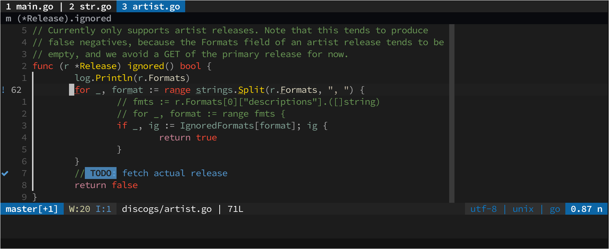

# dotfiles



- Window manager:
  [`dwm`](https://github.com/hejops/dwm)
- Terminal emulator:
  [`wezterm`](./dot_config/wezterm)
- Text editor:
  [`neovim`](./dot_config/nvim)
- File manager:
  [`yazi`](./dot_config/yazi)
- Web browser:
  [`firefox`](./dot_mozilla/firefox) + [`tridactyl`](./dot_config/tridactyl)

## Installation

<https://www.chezmoi.io/quick-start/#using-chezmoi-across-multiple-machines>

```sh
chezmoi init --apply hejops

# alternatively
chezmoi init https://github.com/hejops/dotfiles.git
chezmoi apply -v
# chezmoi update -v
```
